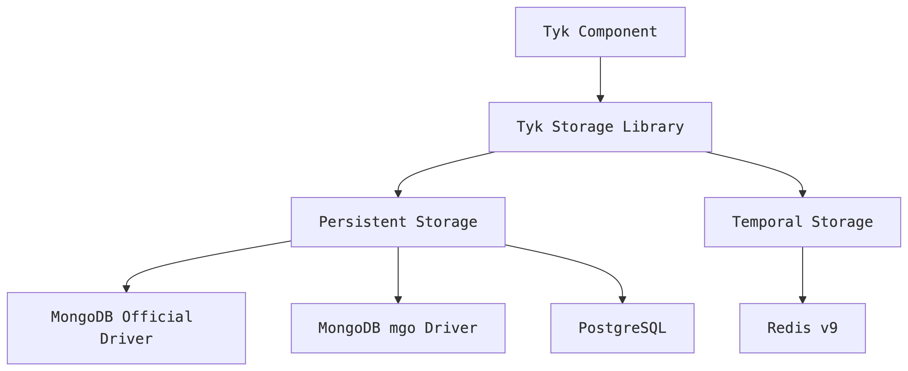

# Tyk Storage 

## About
Tyk Storage is a comprehensive library that provides a common interface for Tyk components to connect to different storage systems. 
It abstracts away the complexities of interacting with various databases and caching systems, allowing Tyk components to focus on their core functionality.
  
## Purpose
The aim of this library is to offer Tyk components an effortless and versatile solution for connecting to storage systems. 
With this library, Tyk components can effortlessly switch between different storage systems without disrupting their application's inner workings. 
It includes typical database operations and healthcheck functionalities to verify a stable connection to the storage system.

## Features

### Persistent storage
- Common interface for database operations (Insert, Delete, Update, Query, etc.)
- Support for MongoDB (both official driver and mgo)
- Support for PostgreSQL
- Index management
- Migration capabilities
- Database health checks

### Temporal storage
- Key-Value operations
- List operations
- Set operations
- Sorted Set operations
- Queue operations with Pub/Sub capabilities
- Redis support

## Installation
`go get github.com/TykTechnologies/storage`

## Usage

### Persistent storage example

```
package main

import (
    "context"
    "log"
    
    "github.com/TykTechnologies/storage/persistent"
)

func main() {
    // Create a new persistent storage client
    opts := &persistent.ClientOpts{
        ConnectionString: "mongodb://localhost:27017",
        Type:             persistent.OfficialMongo,
        Database:         "mydb",
    }
    
    storage, err := persistent.NewPersistentStorage(opts)
    if err != nil {
        log.Fatalf("Failed to create storage: %v", err)
    }
    
    // Check connection
    if err := storage.Ping(context.Background()); err != nil {
        log.Fatalf("Failed to ping database: %v", err)
    }
    
    // Use the storage for database operations
    // ...
}
```

### Temporal storage example

```
package main

import (
    "context"
    "log"
    "time"
    
    "github.com/TykTechnologies/storage/temporal/connector"
    "github.com/TykTechnologies/storage/temporal/keyvalue"
    "github.com/TykTechnologies/storage/temporal/model"
)

func main() {
    // Create a new Redis connector
    redisConnector, err := connector.NewConnector(
        model.RedisV9Type,
        connector.WithRedisConfig(&model.RedisConfig{
            Addr:     "localhost:6379",
            Password: "",
            DB:       0,
        }),
    )
    if err != nil {
        log.Fatalf("Failed to create Redis connector: %v", err)
    }
    
    // Create a key-value store
    kv, err := keyvalue.NewKeyValue(redisConnector)
    if err != nil {
        log.Fatalf("Failed to create key-value store: %v", err)
    }
    
    // Use the key-value store
    err = kv.Set(context.Background(), "mykey", "myvalue", time.Hour)
    if err != nil {
        log.Fatalf("Failed to set key: %v", err)
    }
    
    // Retrieve the value
    value, err := kv.Get(context.Background(), "mykey")
    if err != nil {
        log.Fatalf("Failed to get key: %v", err)
    }
    
    log.Printf("Value: %s", value)
}
```

## Architecture

The Tyk Storage library is divided into two main components:

- Persistent Storage: For long-term data storage using databases like MongoDB and PostgreSQL.
- Temporal Storage: For temporary data storage and caching using systems like Redis.

Each component provides a set of interfaces that abstract the underlying storage implementation, allowing Tyk components to interact with storage systems in a consistent manner.



## Supported Storage Systems

### Persistent Storage
The following storage types are supported through the Type field in ClientOpts:

| Constant                 | Value      | Description                  |
|--------------------------|------------|------------------------------|
| persistent.OfficialMongo | "mongo-go" | Official mongoDB Go driver   |
| persistent.Mgo           | "mgo"      | Legacy mgo MongoDB driver    |
| persistent.Postgres      | "postgres" | PostgreSQL via GORM          |

### Temporal Storage
- Redis v9

## Roadmap
### Completed
- [ ] Persistent storage: common interfaces.
- [ ] Persistent storage: Mongo `mgo` driver.
- [ ] Persistent storage: Mongo `official` driver.
- [ ] Persistent storage: SQL `gorm` driver.

### To be planned

- [ ] Temporal storage: Redis 6 driver.
- [ ] Temporal storage: Redis 7 driver.

Note: This roadmap is a sample and is subject to change based on development progress and priorities.
  
## Contributing

See the [Contributing Guide](CONTRIBUTING.md) for details.

- Maintainers and Approvers ([@TykTechnologies/platform-squad](https://github.com/orgs/TykTechnologies/teams/platform-squad)):
  
### Questions
For question on products, please use [Tyk Community forum](https://community.tyk.io/).
  <br>
Clients can also use support@tyk.io.
   <br>
Potential clients and evaluators, please use info@tyk.io.

  
